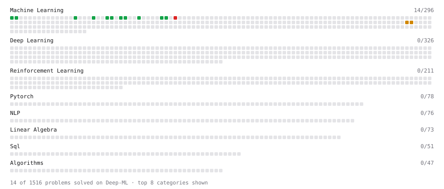

# Deep-ML

My machine learning practice from [Deep-ML](https://www.deep-ml.com). Every solution here was written by hand.

**11** solved · 10 problems · 0 labs · 1 math

[**Browse the interactive portfolio**](https://debasisp97.github.io/deep-ml/) to replay this filling in over time.

## Problems

| | Difficulty | Solved | |
| --- | --- | --- | --- |
| [Binary Classification with Logistic Regression](https://www.deep-ml.com/problems/104) | easy | 2026-10-09 | [solution](problems/0104-binary-classification-with-logistic-regression) |
| [Calculate Accuracy Score](https://www.deep-ml.com/problems/36) | easy | 2026-10-10 | [solution](problems/0036-calculate-accuracy-score) |
| [Calculate Mean Absolute Error (MAE)](https://www.deep-ml.com/problems/93) | easy | 2026-10-09 | [solution](problems/0093-calculate-mean-absolute-error-mae) |
| [Calculate R-squared for Regression Analysis](https://www.deep-ml.com/problems/69) | easy | 2026-10-09 | [solution](problems/0069-calculate-r-squared-for-regression-analysis) |
| [Calculate Root Mean Square Error (RMSE)](https://www.deep-ml.com/problems/71) | easy | 2026-10-09 | [solution](problems/0071-calculate-root-mean-square-error-rmse) |
| [Linear Regression Using Gradient Descent](https://www.deep-ml.com/problems/15) | easy | 2026-09-26 | [solution](problems/0015-linear-regression-using-gradient-descent) |
| [Linear Regression Using Normal Equation](https://www.deep-ml.com/problems/14) | easy | 2026-09-29 | [solution](problems/0014-linear-regression-using-normal-equation) |
| [Mini-Batch Gradient Descent Step for Linear Regression](https://www.deep-ml.com/problems/803) | medium | 2026-10-09 | [solution](problems/0803-mini-batch-gradient-descent-step-for-linear-regression) |
| [Stochastic Gradient Descent Step for Linear Regression](https://www.deep-ml.com/problems/802) | medium | 2026-10-09 | [solution](problems/0802-stochastic-gradient-descent-step-for-linear-regression) |
| [Train Logistic Regression with Gradient Descent](https://www.deep-ml.com/problems/106) | hard | 2026-10-10 | [solution](problems/0106-train-logistic-regression-with-gradient-descent) |

## Math

| | Difficulty | Solved | |
| --- | --- | --- | --- |
| [Logistic Regression as Maximum Likelihood](https://www.deep-ml.com/math-problems/40) | medium | 2026-10-09 | [solution](math/0040-logistic-regression-as-maximum-likelihood) |

---

_This file is regenerated by Deep-ML on every push._
